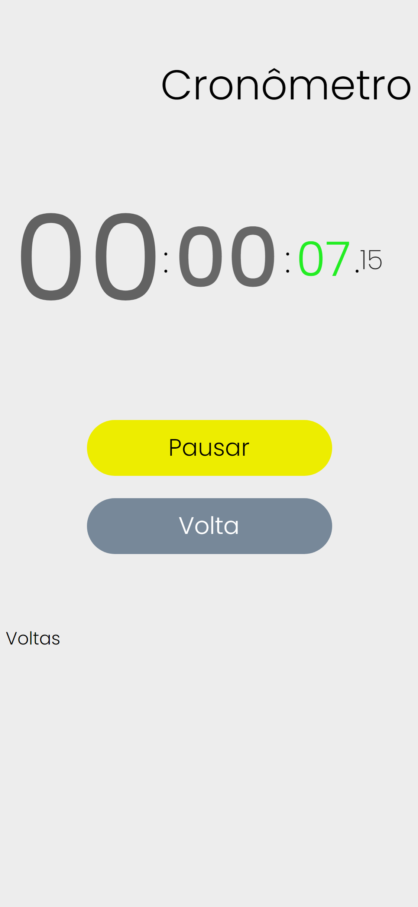
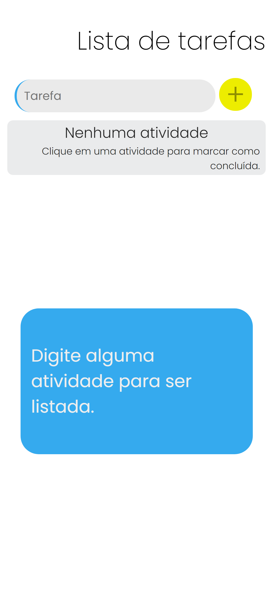

<h1>Modern Round8 </h1>

## Descrição

Biblioteca com apps em um estilo simples e padrão pensado e desenhado para o uso em Smartphones.

## Tecnologias aplicadas
<ul>
  <li> Vanilla JavaScript </li>
  <li> CSS </li>
  <li> HTML </li>
</ul>

## Exemplificação dos aplicativos

 Cronômetro escrito inteiramente em JS.

Descrição app 2
